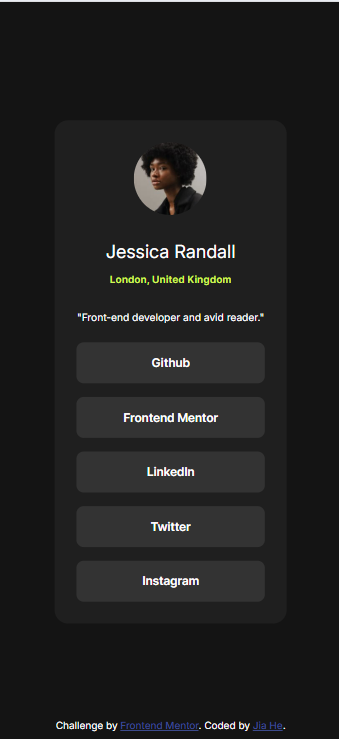

# Frontend Mentor - Social links profile solution

This is my solution to the [Social links profile challenge on Frontend Mentor](https://www.frontendmentor.io/challenges/social-links-profile-UG32l9m6dQ). Frontend Mentor challenges help you improve your coding skills by building realistic projects.

## Table of contents

- [Overview](#overview)
  - [The challenge](#the-challenge)
  - [Screenshot](#screenshot)
  - [Links](#links)
- [My process](#my-process)
  - [Built with](#built-with)
  - [What I learned](#what-i-learned)
  - [Continued development](#continued-development)
  - [Useful resources](#useful-resources)
- [Author](#author)

## Overview

### The challenge

Users should be able to:

- View the social profile component centered on the page
- See hover states for all interactive elements

### Screenshot

#### 📱 Mobile



#### 💻 Desktop


### Links

- Solution URL: [My Github repo](https://github.com/JiaHe35354/social-links-profile)
- Live Site URL: [https://social-links-profile-jia.netlify.app/](https://social-links-profile-jia.netlify.app/)

## My process

### Built with

- Semantic HTML5 markup
- CSS custom properties
- Flexbox
- Mobile-first workflow

### What I learned

While building this component, I practiced:

- Structuring a small component semantically with HTML
- Centering content using Flexbox on both axes
- Creating hover effects using transitions
- Using CSS variables for cleaner and more maintainable styles

Here's a small snippet I'm proud of:

```css
.list-item:hover {
  background-color: var(--color-green);
  cursor: pointer;
}

.list-item:hover .link {
  color: var(--color-grey-dark);
}
```

This adds interactivity to the buttons while preserving good contrast and accessibility.

### Continued development

In future projects, I want to focus more on:

- CSS logical properties to improve support for different writing directions

### Useful resources

- [Google Fonts](https://fonts.google.com/?query=Inter)

## Author

- Frontend Mentor - [@JiaHe35354](https://www.frontendmentor.io/profile/JiaHe35354)
